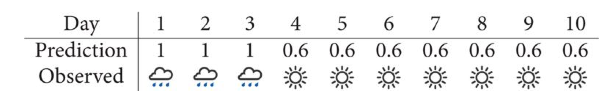

```{r setup, include=FALSE}
knitr::opts_chunk$set(echo = TRUE)
require(mosaic)
require(rethinking)
require(ggformula)
require(printr)

knitr::opts_chunk$set(
  fig.keep = "hold"
)

trellis.par.set(theme = theme.mosaic())
theme_set(theme_light())
```

## Overfitting

### Brains Data

This small data set giving the brain volume (cc) and body mass (kg) for several
species.  It is used to illustrate a very bad idea -- improving the "fit" by 
increasing the degree of the polynomial used to model the relationship
between brain size and body mass.

#### R code 6.1

```{r, chunk6.1}
Brains <- 
  data.frame(
    species =  c("afarensis", "africanus", "habilis", "boisei",
                 "rudolfensis", "ergaster", "sapiens"),
    brain_size = c(438, 452, 612, 521, 752, 871, 1350),
    body_mass =  c(37.0, 35.5, 34.5, 41.5, 55.5, 61.0, 53.5)
  )
gf_point(brain_size ~ body_mass, data = Brains, 
         size = 2, color = "red", alpha = 0.6, verbose = TRUE)  %>%
  gf_text(brain_size ~ body_mass + label:species, alpha = 0.8, 
          color = "navy", size = 3, angle = 30)
```

#### R code 6.2

See Chapter 5 for more about `lm()` (and Bayesian versions of `lm()`).
The model being fit below is 

\begin{align*}
 \mbox{brain_size} & \sim \mathrm{Norm}(\mu, \sigma) \\
 \mu  & \sim a + b \cdot \mbox{body_mass} 
\end{align*}
There are no priors because `\lm()` isn't using a Bayesian approach.  
We're using `\lm()` here because it is faster to fit an the syntax
is terser, but the same principle would be illustrated if we used
a Bayesian linear model instead.


```{r, chunk6.2}
m6.1 <- lm(brain_size ~ body_mass, data = Brains)
```

(Note: `\lm()` fits the parameters using "maximum likelihood".  You can
think of this as using uniform priors on the coefficients, 
which means that the posterior is proportional to the likelihood, 
and maximum likelihood estimates are the same as the MAP estimates.
The estimate for $\sigma$ that `\lm()` uses is modified to make it
an *unbiased estimator*.)

### Measuring fit with $r^2$

#### R code 6.3

$r^2$ can be defined several equivalent ways.  Here are using the "proportion
of variation that is 'explained' by the model".  The residual variance
is unexplained.  The variance of the response variable is our denominator.
```{r, chunk6.3}
1 - var(resid(m6.1)) / var(Brains$brain_size)
rsquared(m6.1)
```

#### R code 6.4

This model uses a quadratic relationship.

```{r, chunk6.4}
m6.2 <- lm(brain_size ~ poly(body_mass,2), data = Brains)
rsquared(m6.2)
```

#### R code 6.5

We can use any degree polynomial in the same way.

```{r, chunk6.5}
m6.1 <- lm(brain_size ~ poly(body_mass, 1), data = Brains)
m6.2 <- lm(brain_size ~ poly(body_mass, 2), data = Brains)
m6.3 <- lm(brain_size ~ poly(body_mass, 3), data = Brains)
m6.4 <- lm(brain_size ~ poly(body_mass, 4), data = Brains)
m6.5 <- lm(brain_size ~ poly(body_mass, 5), data = Brains)
m6.6 <- lm(brain_size ~ poly(body_mass, 6), data = Brains)
```

`poly(body_mass, k)` creates a degree $k$ polynomial in $k$ (but parameterized in
a special way that makes some kinds of statistical analysis easier -- we 
are concerned with the particular parameterization here, just the overall
model fit).

#### R code 6.6

And finally, here is a degree 0 polynomial (a constant).

```{r, chunk6.6}
m6.7 <- lm(brain_size ~ 1, data = Brains)
```

### Leave One Out Analysis

#### R code 6.7

Here's how you remove one row from a data set.
```{r, chunk6.7}
Brains.new <- Brains[-2, ]
```


One simple version of cross-validation is to fit the model several times,
but each time leaving out one observation (hence the name "leave one out").
We can compare these models to each other to see how stable/volitile
the moel fits are and to see how well the "odd one out" is predicted 
from the remaining observations.

#### R code 6.8

```{r, chunk6.8}
leave_one_out <-
  function(index = 1, degree = 1, ylim = c(0, NA)) {
    for(i in index)
      for(d in degree) {
        gf_point(brain_size ~ body_mass + color:remove, 
                 data = Brains %>% mutate(remove = 1:nrow(Brains) %in% i)) %>%
          gf_smooth(brain_size ~ body_mass, formula = y ~ poly(x, d), 
                    data = Brains[-i, ], method = "lm") %>% 
          gf_labs(title = paste("removed:", i, " ;  degree =", d)) %>%
          gf_lims(y = ylim) %>%
          print()
      }
  }
```

The simple linear model changes only slightly when we remove each data point 
(although the model's uncertainty decreases quite a bit when we remove the 
data point that is least like the others).

```{r, warning = FALSE}
leave_one_out(1:nrow(Brains), degree = 1, ylim = c(-2200, 4000))
```
Cubic models and their uncertainties change more -- they are more sensitive to the data.

```{r}
leave_one_out(1:nrow(Brains), degree = 3, ylim = c(-2200, 4000))
```

With a 5th degree polynomial (6 coefficients), the fit to the six data points 
is "perfect", but highly volitile. 
The model has no uncertainty, but it is overfitting and overconfident.  
The fit to the omitted point might not be very reliable.

```{r}
leave_one_out(1:nrow(Brains), degree = 5, ylim = c(-2200, 4000))
```

## Measuring fit

### $R^2$

Using $R^2$ alone as a measure of fit has the problem that $R^2$ increases
as we add complexity to the model, which pushes us toward overfitting.

```{r}
Brains.R2 <-
  data_frame(
    degree = 0:6,
    R2 = sapply( list(m6.7, m6.1, m6.2, m6.3, m6.4, m6.5, m6.6), rsquared)
  )
Brains.R2
gf_point(R2 ~ degree, data = Brains.R2) %>%
  gf_line(R2 ~ degree, data = Brains.R2, alpha = 0.5) %>%
  gf_labs(x = "degree of polynomial", y = expression(R^2))
```

There are ways to adjust $R^2$ to reduce this problem, but we are going to introduce 
other methods of measuring fit.

```{r}
gf_point(R2 ~ degree + color::factor(degree), data = Brains.R2) %>%
  gf_line(R2 ~ degree, data = Brains.R2, alpha = 0.5) %>%
  gf_segment(R2 + 1 ~ degree + 7 + color::factor(degree), 
             data = Brains.R2, alpha = 0.3) %>%
  gf_labs(x = "degree of polynomial", y = expression(R^2))
```

### Weather Prediction Accuracy

Consider the predictions of two weather people over the same set of 10 days.
Which one did a better job of predicting?  How should we measure this?

 * **First Weather Person:**

    

 * **Second Weather Person:**

    

Last time we discussed some ways to compare which weather person makes the best predictions.
Here is one more: Given each weather person's "model" as a means of generating data, which 
one makes the observed weather most likely?  Now weather person 1 wins handily:

```{r}
# WP #1
1^3 * 0.4^7
# WP #2 -- no chance!
0^3 * 1^7
```
This has two advantages for us:

 1. This is just the likelihood, an important part of our Bayesian modeling system.
 
 2. It is based on joint probability rather than average probability.  Weather person 2 is taking unfair advantage of average probability by making predictions we know are "impossible".

## Shannon Entropy and related notions

Now let's take a bit of a detour on the road to another method of assessing the predictive
accuracy of a model.  The route will look something like this:

$$
\mbox{Information} \to \mbox{(Shannon) Entropy} \to \mbox{Divergence} \to \mbox{Deviance} \to \mbox{Inforation Criteria (DIC and WAIC)}
$$

DIC (Deviance Information Criterion) and WAIC (Widely Applicable Information Criterion) are 
where we are heading.  For now, you can think of them as improvements to (adjusted) $R^2$
that will work better for Bayesian models.

### Information

Let's begin by considering the amount of 
information we gain when we observe some random process.  
Suppose that the event we observed has probability $p$.
Let $I(p)$ be the amount of information we gain from observing 
this outcome.  $I(p)$ depends on $p$ but not on the outcome itself,
and should satisfy the following properties.

 1. $I(1)$ = 0.  
 
    Since the outcome was certain, we didn't learn anything by observing.
 
 2. $I(0)$ is undefined.
 
    We won't observe an outcome with probability 0.
 
 3. $I()$ is a decreasing function of $p$.  
 
    The more unusual the event, the more information we obtain when it occurs.
    In particular, $I(p) \ge 0 for all $p \in (0, 1]$.

 4. $I(p_1 p_2) = I(p_1) + I(p_2)$.  
 
    This is motivated by independent events.  If we observe two independent 
    events $A_1$ and $A_2$ with probabilities $p_1$ and $p_2$, we can consider this as a single event with
    probability $p_1 p_2$.

The function $I()$ should remind you of a function you have seen before.
Logarithms satisfy these properties 1, 2, and 4, but logarithms are increaseing
functions.  We get the function we want if we define

$$
I(p) = - \log(p) = \log(1/p)
$$
We can choose any base we like: 2, $e$, and $10$ are common choices.  
Our text chooses natural logarithms.  
In can be shown that negative logarithms are the only
functions that have our desired properties.

### Entropy

Now consider a random process $X$ with $n$ outcomes having probabilities 
$\mathbf{p} = p_1, p_2, \dots, p_n$. That is,
$$
P(X = x_i) = p_i,
$$
The amount of information for each outcome depends on $p_i$.
The **Shannon entropy** (denoted $H$) is the average amount of information
gained from each observation of the random process:

$$
H(X) = H(\mathrm{p}) = \mathrm{expected \ information} =  \sum p_i \cdot I(p_i) = - \sum p_i \log(p_i)
$$

Note that 

 * $H(X) \ge 0$ since $p_i \ge 0$ and $I(p_i) = - \log(p_i) \ge 0$.  
 * Outcomes with probability 0 must be removed from the list or we can treat $0 \log(0)$ as $0$ 
  for the purposes of entropy. (Note: $\lim_{q \to \infty} q \log(q) = 0$, so this is a continuous extension.)
 * $H(X)$, like $I(p_i)$ depends only on the probabilities, not on the outcomes themselves.
 * $H$ is a **continuous** function.
 * Among all distributions with a fixed number of outcomes, $H$ is **maximized** 
     when all outcomes are equally likely (for a fixed number of outcomes)
 * among equiprobable distributions $H$ **increases as the number of outcomes increases**.
 * $H$ is **additive** in the following sense: if $X$ and $Y$ are independent, then
 $H(\langle X, Y\rangle) = H(X) + H(Y)$.
  
 
$H$ can be thought of as a measure of **uncertainty**.
Uncertainty decreases as we make observations.

 * Consider a random variable that takes on only one value (all the time).  
 There is nothing uncertain, and $H(X) = 1 \cdot \log(1) = 0$.
 
```{r, chunk6.9a}
p <- 1
- sum(p * log(p))
```

 * A random coin toss has entropy 1 if we use base 2 logarithms.  (In this case the unit is called a **shannon** 
 or a bit of uncertainty.)

Applied to a 50-50 coin we get:
```{r, chunk6.9b}
p <- c(0.5, 0.5)
# one shannon of uncertainty
- sum(p * log2(p))
```
 * In the text, the default is natural logarithms.  
 In that case, the unit for entropy is called a **nat**, and  the entropy of a fair coin toss is
 
```{r, chunk6.9c}
p <- c(0.5, 0.5)
# uncertainty of a fair coin in nats
- sum(p * log(p))
```

```{r}
H <- function(p, base = exp(1)) {
  - sum(p * log(p, base = base))
}
# in nats
H(c(0.5, 0.5))
H(c(0.3, 0.7))
# in shannons
H(c(0.5, 0.5), base = 2)
H(c(0.3, 0.7), base = 2)
```

### Decrease in Entropy = Gained Information

Decreases in this uncertainty are gained information.  


#### R code 6.9

Applied to a 30-70 coin we get:
```{r, chunk6.9}
p <- c(0.3, 0.7)
- sum(p * log(p))
```

### Divergence

Kullback-Leibler divergence compares two distributions and asks "if we are 
anticipating \mathrm{q}, but get \mathrm{p}, how much more surprised will
we be than if we had been expecting \mathrm{p} in the first place?"

Here's the definition

$$
D_{KL}(\mathrm{p}, \mathrm{q}) = 
\mathrm{expected\ difference\ in\ ``surprise"} 
= \sum p_i \left( I(q_i) - I(p_i) \right)
= \sum p_i I(q_i) - \sum p_i I(p_i) 
$$

This looks like the difference between two entropies.  It alsmost is.
The first one is actually a **cross entropy** where we use probabilities
from one distribution and information from the other.  We denote this
$$
H(\mathbf{p}, \mathbf{q}) = \sum p_i I(q_i) = - \sum p_i \log(q_i)
$$
Note that $H(\mathbf{p}) = H(\mathbf{p}, \mathbf{p})$, so
\begin{align*}
D_{KL} &= H(\mathrm{p}, \mathrm{q}) - H(\mathrm{p})
\\
&=
\sum p_i \log(p_i) - \sum p_i \log(q_i)
\\
&= \sum p_i (\log(p_i) - \log(q_i)).
\end{align*}


#### R code 6.10

```{r, chunk6.10}
# fit model with lm
m6.1 <- lm(brain_size ~ body_mass, data = Brains)

# compute deviance by cheating
(-2) * logLik(m6.1)
```

#### R code 6.11

```{r, chunk6.11}
# standardize the body_mass before fitting
Brains <-
  Brains %>% mutate(body_mass.s = zscore(body_mass))
    
m6.8 <- map(
  alist(brain_size ~ dnorm(mu, sigma),
        mu <- a + b * body_mass.s),
  data = Brains,
  start = list(
    a = mean(Brains$brain_size),
    b = 0,
    sigma = sd(Brains$brain_size)
  ),
  method = "Nelder-Mead"
)

# extract MAP estimates
theta <- coef(m6.8); theta

# compute deviance
dev <- (-2) * sum(dnorm(
  Brains$brain_size,
  mean = theta[1] + theta[2] * Brains$body_mass.s,
  sd = theta[3],
  log = TRUE
))
dev %>% setNames("dev")  # setNames just labels the out put
-2 * logLik(m6.8)        # for comparison
```

#### R code 6.12

```{r, chunk6.12, cache = TRUE}
require(tidyr)
Sims0 <- expand.grid(n = c(20,100), k = 1:5, rep = 1:1e3) 
Sims <-
  bind_cols(
    Sims0,
    apply(Sims0, 1, function(x) sim.train.test(N = x["n"], k = x["k"])) %>%
      t() %>%         # flip rows/cols
      data.frame() %>% # convert to data.frame
      setNames(c("dev.in", "dev.out"))  # give better names to vars
  )

# reshape, then comput mean and PI
Sims2 <-
  Sims %>%
  gather(dev_type, dev, dev.in : dev.out) %>%
  group_by(n, k, dev_type) %>%
  summarise(
    mean = mean(dev),
    lo = PI(dev, .50)[1],
    hi = PI(dev, .50)[2]
  )
```

#### R code 6.13

```{r, chunk6.13, eval = FALSE}
r <- mcreplicate(1e4, sim.train.test(N = N, k = k), mc.cores = 4)
```

#### R code 6.14

This plot uses 50% PIs (rather than $\pm$ 1 sd, as in the book) for the bars.  
The gray dots indicate that $AIC = D_{\mathrm{in}} + 2p$ is a good estimate for out-of-sample 
deviance.
```{r, chunk6.14}
gf_pointrange(
  mean + lo + hi ~ k + col:dev_type, data = Sims2,
  position = position_dodge(width = 0.2), verbose = TRUE) %>%
  gf_point((mean + 2*k) ~ k, data = Sims2 %>% filter(dev_type == "dev.in"), 
           color = "black", shape = 1, alpha = 0.4) %>%
  gf_line((mean + 2*k) ~ k, data = Sims2 %>% filter(dev_type == "dev.in"), 
           color = "black", alpha = 0.4, linetype = "dashed") %>%
  gf_labs(x = "number of parameters", y =  "deviance") %>%
  gf_refine(facet_grid(paste("N =", n) ~ ., scales = "free"))
```


```{r}
SimsSmry <- 
  Sims %>% group_by(k) %>% 
  summarise(
    mean.in = mean(dev.in),
    mean.out = mean(dev.out),
    mean.diff = mean(dev.out - dev.in))
SimsSmry %>% round(1)

gf_dens( ~ (dev.out - dev.in) + color::factor(k), data = Sims) %>%
  gf_segment(0 + 0.04 ~ mean.diff + mean.diff + color::factor(k), 
             data = SimsSmry, alpha = 0.4) %>%
  gf_refine(scale_x_continuous(limits = c(-25, 30)))
```

#### R code 6.15

```{r, chunk6.15}
data(cars)
m <- 
  map(
    alist(
      dist ~ dnorm(mu, sigma),
      mu <- a + b * speed,
      a ~ dnorm(0, 100),
      b ~ dnorm(0, 10),
      sigma ~ dunif(0, 30)
    ),
    start = list(a = 0, b = 0, sigma = 15),
    data = cars)
cars.post <- extract.samples(m, n = 1000)
```

#### R code 6.16

```{r, chunk6.16}
# matrix of loglikelihoods (for each posterior sample and each observation in cars)
cars.ll <- 
  sapply(
    1:nrow(cars.post),
    function(s) {
      mu <- cars.post$a[s] + cars.post$b[s] * cars$speed
      dnorm(cars$dist, mu, cars.post$sigma[s], log = TRUE)
    })
```

#### R code 6.17

```{r, chunk6.17}
cars.lppd <-
  apply(cars.ll, 1, function(x) log_sum_exp(x) - log(nrow(cars.post)))
```

#### R code 6.18

```{r, chunk6.18}
cars.pWAIC <- apply(cars.ll, 1, var)
```

#### R code 6.19

```{r, chunk6.19}
-2 * (sum(cars.lppd) - sum(cars.pWAIC))
```

#### R code 6.20

```{r, chunk6.20}
cars.waic_vec <- -2 * (cars.lppd - cars.pWAIC)
sqrt(nrow(cars) * var(cars.waic_vec))
```

## Comparing Milk Models

#### R code 6.21

```{r, chunk6.21}
data(milk)
MilkCC <- milk %>% filter(complete.cases(.)) %>%
  mutate(
    neocortex = neocortex.perc / 100
  )
dim(MilkCC)
```

#### R code 6.22

```{r, chunk6.22}
a.start <- mean(MilkCC$kcal.per.g)
sigma.start <- log(sd(MilkCC$kcal.per.g))
m6.11 <- map(
  alist(kcal.per.g ~ dnorm(a, exp(log.sigma))),
  data = MilkCC,
  start = list(a = a.start, log.sigma = sigma.start)
)
m6.12 <- map(
  alist(kcal.per.g ~ dnorm(mu, exp(log.sigma)),
        mu <- a + bn * neocortex),
  data = MilkCC,
  start = list(a = a.start, bn = 0, log.sigma = sigma.start)
)
m6.13 <- map(
  alist(kcal.per.g ~ dnorm(mu, exp(log.sigma)),
        mu <- a + bm * log(mass)),
  data = MilkCC,
  start = list(a = a.start, bm = 0, log.sigma = sigma.start)
)
m6.14 <- map(
  alist(kcal.per.g ~ dnorm(mu, exp(log.sigma)),
        mu <- a + bn * neocortex + bm * log(mass)),
  data = MilkCC,
  start = list(
    a = a.start,
    bn = 0,
    bm = 0,
    log.sigma = sigma.start
  )
)
```

### WAIC

#### R code 6.23

```{r, chunk6.23}
WAIC(m6.14)
```

#### R code 6.24

```{r, chunk6.24}
(milk.models <- compare(m6.11, m6.12, m6.13, m6.14))
```

#### R code 6.25

```{r, chunk6.25}
plot(milk.models, SE = TRUE, dSE = TRUE)
```

#### R code 6.26

```{r, chunk6.26}
diff <- rnorm(1e5, 6.7, 7.26)
sum(diff < 0) / 1e5
```

#### R code 6.27

```{r, chunk6.27}
coeftab(m6.11, m6.12, m6.13, m6.14)
coeftab(m6.11, m6.12, m6.13, m6.14, se = TRUE)
```

#### R code 6.28

```{r, chunk6.28, fig.height = 6}
plot(coeftab(m6.11, m6.12, m6.13, m6.14))
```

With a little work, we can roll our own plot.  The main advantage to this is
that we can use a different scale for each parameter.  This is bit clunky because
the `coeftab` object is stored awkwardly.  (Looks like another item
for the `rethinking` pacakge to-do list.)

```{r, fig.width = 6}
CT <- coeftab(m6.11, m6.12, m6.13, m6.14)
CTc <- CT@coefs
CTse <- CT@se
colnames(CTse) <- colnames(CTc)

CTd <-
  left_join(
    as.data.frame(CTc) %>%
      mutate(param = row.names(CTc)) %>%
      tidyr::gather(model, estimate, 1:ncol(CTc)),
    as.data.frame(CTse) %>%
      mutate(param = row.names(CTse)) %>%
      tidyr::gather(model, se, 1:ncol(CTse))
  )

gf_hline(yintercept = 0, color = "red",  alpha = 0.4) %>%
  gf_pointrange( 
    estimate + (estimate - se) + (estimate + se) ~ model,
    data = CTd) %>%
  gf_facet_wrap(~ param, scales = "free") %>%
  gf_refine(coord_flip())
```
This plot provides a much better view of parameters on different scales.

#### R code 6.29

```{r, chunk6.29}
# compute counterfactual predictions
# neocortex from 0.5 to 0.8
Milk.predict <- data_frame(
  neocortex = seq(from = 0.5, to = 0.8, length.out = 30),
  kcal.per.g = 0,
  mass = 4.5  # average mass
)
pred.m6.14 <- link(m6.14, data = Milk.predict)
Milk.predict <-
  Milk.predict %>%
  mutate(
    mu =  apply(pred.m6.14, 2, mean),
    mu.PIlo = apply(pred.m6.14, 2, PI)[1,],
    mu.PIhi = apply(pred.m6.14, 2, PI)[2,]
    )

# plot it all
gf_point(kcal.per.g ~ neocortex, data = MilkCC, color = rangi2) %>%
  gf_line(mu ~ neocortex, data = Milk.predict, color = "red") %>%
  gf_ribbon(mu.PIlo + mu.PIhi ~ neocortex, data = Milk.predict)
```

#### R code 6.30

```{r, chunk6.30}
Milk.ensemble <-
  ensemble(m6.11, m6.12, m6.13, m6.14, data = Milk.predict)
Milk.predict <-
  Milk.predict %>%
  mutate(
    mu.ens =  apply(Milk.ensemble$link, 2, mean),
    mu.ens.lo =  apply(Milk.ensemble$link, 2, PI)[1,],
    mu.ens.hi =  apply(Milk.ensemble$link, 2, PI)[2,]
    )
gf_line(mu.ens ~ neocortex, data = Milk.predict) %>%
  gf_ribbon(mu.ens.lo + mu.ens.hi ~ neocortex, data = Milk.predict)
```

#### R code 6.31

```{r, chunk6.31}
library(rethinking)
data(Howell1)
Howell <- 
  Howell1 %>% 
  mutate(
    age.s = zscore(age)
  )
set.seed(1000)     # so we all get the same "random" data sets
train <- sample(1:nrow(Howell), size = nrow(Howell) / 2)  # half of the rows
Howell.train <- Howell[train, ]   # put half in training set
Howell.test <- Howell[-train, ]   # the other half in test set
```

#### R code 6.32

```{r, chunk6.32, eval = FALSE}
sum(dnorm(Howell.test$height, mu, sigma, log = TRUE))
```

