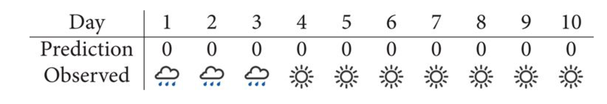

```{r setup, include=FALSE}
knitr::opts_chunk$set(echo = TRUE)
require(mosaic)
require(rethinking)
require(ggformula)
require(printr)
require(tidyr)

knitr::opts_chunk$set(
  fig.keep = "hold"
)

trellis.par.set(theme = theme.mosaic())
theme_set(theme_minimal())
```

## Weather Prediction Accuracy

Consider the predictions of two weather people over the same set of 10 days.
Which one did a better job of predicting?  How should we measure this?

 * **First Weather Person:**

    

 * **Second Weather Person:**

    

Last time we discussed some ways to compare which weather person makes the best predictions.
Here is one more: Given each weather person's "model" as a means of generating data, which 
one makes the observed weather most likely?  

\vspace{1in}

```{r, include = FALSE}
# WP #1
1^3 * 0.4^7
# WP #2 -- no chance!
0^3 * 1^7
```
This has two advantages for us:

 <!-- 1.  This is just the likelihood, an important part of our Bayesian modeling system. -->

 <!-- 2. It is based on joint probability rather than average probability.  Weather person 2 is taking unfair advantage of average probability by making predictions we know are "impossible". -->

